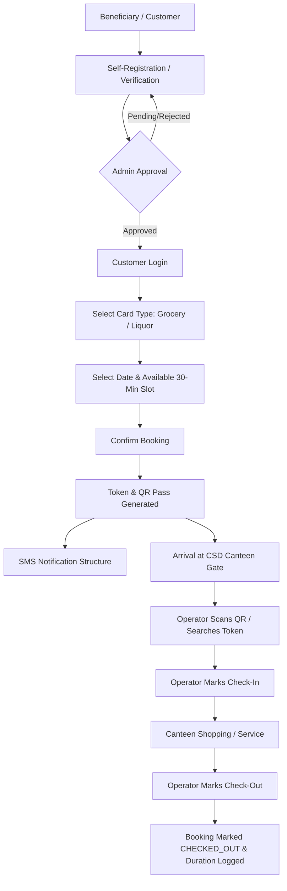
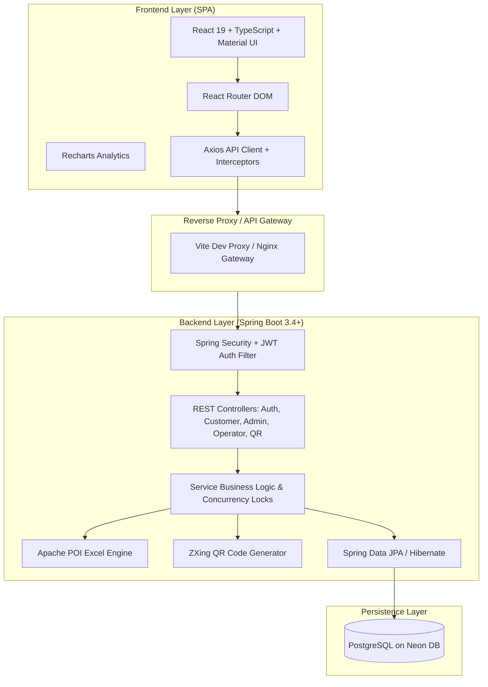
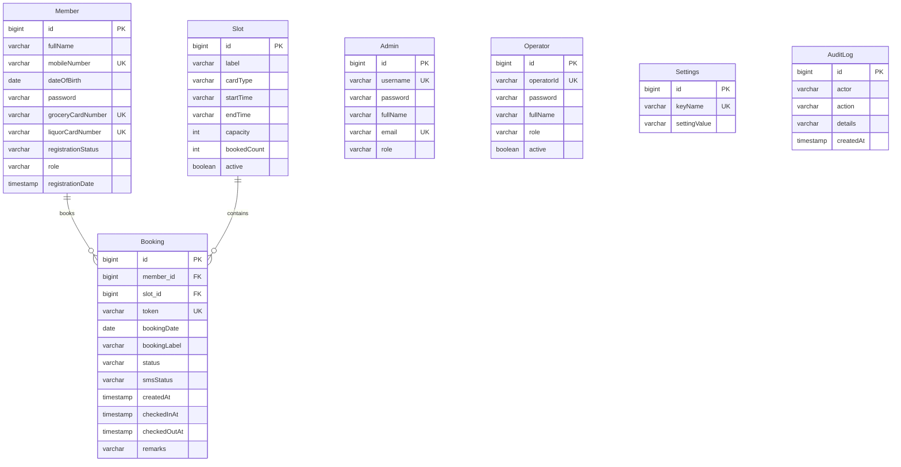

# CSD Smart Slot Booking & Token Management System

<div align="center">


**An enterprise-grade digital reservation, token lifecycle, and queue orchestration platform engineered to eliminate physical congestion and streamline footfall in Canteen Stores Department (CSD) facilities.**

[Key Features](#-key-features) • [Architecture](#-architecture) • [Workflow](#-system-workflow) • [Database Design](#-database-design) • [API Specification](#-api-specification) • [Local Setup](#-local-setup)

</div>

---

## 📌 Executive Summary

The **CSD Smart Slot Booking & Token Management System** is a full-stack web application designed to solve real-world crowd management challenges at high-volume defense and paramilitary CSD canteens. 

By replacing unorganized physical queues with **controlled 30-minute reservation windows**, **real-time capacity tracking**, **separate Grocery/Liquor quota governance**, and **QR-based gate verification**, the platform ensures transparent, predictable, and orderly service for beneficiaries while providing administrators and gate operators with complete operational visibility.

---

## 🛑 Problem Statement

High-demand retail environments like CSD canteens face severe operational bottlenecks:

* **Unpredictable Crowd Surges:** Peak-hour rushes lead to severe crowding, long wait times, and security risks.
* **Manual Record-Keeping & Verification:** Physical registers make it difficult to verify active beneficiaries, track past visits, or enforce monthly quota limits.
* **Lack of Capacity Visibility:** Beneficiaries arrive without knowing if slots or inventory are available, leading to frustration.
* **Counter Imbalance:** Grocery and Liquor counters experience uneven demand, causing congestion at specific distribution points.
* **Inefficient Gate Processing:** Manual paper token validation slows entry and exit, creating choke points at security gates.

---

## 💡 The Solution

This system digitizes the entire lifecycle of a canteen visit:

1. **Pre-Visit Verification & Booking:** Beneficiaries register with verified card numbers and select specific 30-minute time slots based on real-time availability.
2. **Deterministic Token Generation:** Generates unique, tamper-evident digital tokens paired with verifiable QR codes.
3. **Streamlined Counter Segregation:** Independent scheduling and capacity quotas for **Grocery** and **Liquor** counters prevent cross-congestion.
4. **Rapid Operator Check-In/Check-Out:** Gate operators scan QR codes or search tokens to timestamp arrivals, monitor active visitor counts, and log departure durations.
5. **Administrative Governance & Reporting:** Full audit trails, holiday calendars, dynamic booking window adjustments, and automated multi-sheet Excel reports for administrative oversight.

---

## 🚀 Key Features

### 👤 Customer Portal (Beneficiary)
* **Pre-Verification & Onboarding:** Secure self-registration capturing military/service credentials, Grocery Card, and Liquor Card numbers with admin review workflows.
* **Live Slot Discovery:** Real-time visibility into available slots filtered by date and category (Grocery / Liquor).
* **30-Minute Interval Booking:** Smart slot selection preventing duplicate bookings, enforcing daily allowances, and verifying booking windows.
* **Digital Token & QR Pass:** Instant generation of unique tokens with scannable QR passes for rapid gate authentication.
* **Booking Lifecycle & Self-Service:** Live status tracking (`BOOKED`, `CHECKED_IN`, `CHECKED_OUT`, `CANCELLED`), booking cancellation, and historical visit logs.
* **Profile Management:** Secure profile updates and credential management.

### 🛡️ Operator Portal (Gate & Counter Desk)
* **Multi-Parameter Search:** Instant lookup by Token ID, Mobile Number, Grocery Card, or Liquor Card.
* **Single-Click Check-In & Check-Out:** Gate timestamping that calculates dwell times and updates real-time building occupancy.
* **Queue Monitor:** Live queue board displaying current token order and scheduled arrivals.
* **Cancellation Handling:** Ability to cancel delinquent or no-show bookings with automatic capacity recovery.

### ⚙️ Admin Portal (Canteen Management)
* **Real-Time KPI Dashboard:** Live statistics on registered members, daily footfall, active occupancy, and counter utilization.
* **Member Approval Lifecycle:** Review pending customer registrations with single-click Approve / Reject actions.
* **Slot & Quota Configuration:** Create, adjust, activate, or deactivate slots, time ranges, and capacity thresholds (default: 30 beneficiaries / 30 mins).
* **System Rules & Holiday Controls:** Configure weekly off-days, special festival holidays, booking windows, and category-wide disable toggles.
* **Comprehensive Excel Reports:** Export member directories, daily booking logs, check-in/out timestamps, and audit records using Apache POI.
* **Audit Trail System:** Centralized logging of all administrative actions and security events.

---

## 🔄 System Workflow



---

## 🏛️ System Architecture



---

## 📸 Interface Showcase

> Screenshot placeholders below correspond to files in [`docs/screenshots/`](docs/screenshots/).

| Screen | Description | Reference |
| :--- | :--- | :--- |
| **Landing Page** | Public portal displaying real-time canteen status, operating hours, and live availability metrics. | `docs/screenshots/01-landing-page.png` |
| **Customer Portal** | Beneficiary dashboard with active token pass, recent bookings, and slot selector. | `docs/screenshots/03-customer-dashboard.png` |
| **Slot Booking** | Date-based slot reservation interface with live capacity progress bars. | `docs/screenshots/04-slot-booking.png` |
| **Digital QR Pass** | High-contrast QR gate pass rendered for operator scanning. | `docs/screenshots/05-token-qr-pass.png` |
| **Admin Dashboard** | Real-time command center showing footfall analytics, counter usage, and pending reviews. | `docs/screenshots/06-admin-dashboard.png` |
| **Operator Desk** | Rapid token lookup, gate check-in/check-out panel, and active queue monitoring. | `docs/screenshots/10-operator-queue.png` |

---

## 🗄️ Database Design & Entity Model

The relational database is deployed on **PostgreSQL (Neon DB)** with strict foreign key constraints and transactional integrity.



---

## 🔌 API Specification Overview

### 🔐 Authentication (`/api/auth`)
| Method | Endpoint | Access | Description |
| :--- | :--- | :--- | :--- |
| `POST` | `/api/auth/register` | Public | Submit new member registration for admin review |
| `POST` | `/api/auth/customer/login` | Public | Beneficiary authentication returning JWT |
| `POST` | `/api/auth/operator/login` | Public | Operator desk authentication |
| `POST` | `/api/auth/admin/login` | Public | Administrative authentication |

### 👤 Customer Endpoints (`/api/customer`)
| Method | Endpoint | Access | Description |
| :--- | :--- | :--- | :--- |
| `GET` | `/api/customer/landing` | Public | Retrieve public canteen stats & live slot availability |
| `POST` | `/api/customer/verify` | Public | Validate member existence prior to booking |
| `GET` | `/api/customer/slots/{cardType}` | Public | Fetch active slots and real-time remaining capacity |
| `POST` | `/api/customer/book` | Public/Auth | Reserve a 30-minute slot with pessimistic locking |
| `GET` | `/api/customer/track/{mobileNumber}` | Public | Retrieve real-time booking status by mobile number |
| `GET` | `/api/customer/history/{memberId}` | Customer | View full historical visit records |
| `POST` | `/api/customer/cancel/{bookingId}/{memberId}` | Customer | Cancel an active upcoming reservation |
| `GET/PUT`| `/api/customer/profile/{memberId}` | Customer | View or update member profile details |
| `PUT` | `/api/customer/change-password/{memberId}` | Customer | Change account password |

### 🛡️ Operator Endpoints (`/api/operator`)
| Method | Endpoint | Access | Description |
| :--- | :--- | :--- | :--- |
| `GET` | `/api/operator/queue` | Operator | Retrieve today's active queue and arrival list |
| `GET` | `/api/operator/search` | Operator | Search bookings by Token, Mobile, or Card Number |
| `GET` | `/api/operator/booking/{token}` | Operator | Fetch detailed booking metadata by Token ID |
| `POST` | `/api/operator/check-in/{bookingId}` | Operator | Timestamp arrival and mark status `CHECKED_IN` |
| `POST` | `/api/operator/check-out/{bookingId}` | Operator | Timestamp departure and mark `CHECKED_OUT` |
| `POST` | `/api/operator/cancel/{bookingId}` | Operator | Cancel no-show or invalid booking |

### ⚙️ Admin Endpoints (`/api/admin`)
| Method | Endpoint | Access | Description |
| :--- | :--- | :--- | :--- |
| `GET` | `/api/admin/dashboard` | Admin | Retrieve operational KPIs and analytics |
| `GET` | `/api/admin/members` | Admin | Search and filter registered members |
| `GET` | `/api/admin/members/pending` | Admin | Fetch pending member registration queue |
| `PUT` | `/api/admin/members/{id}/approve` | Admin | Approve pending member account |
| `PUT` | `/api/admin/members/{id}/reject` | Admin | Reject pending member account |
| `GET/POST`| `/api/admin/slots` | Admin | View or create 30-minute booking slots |
| `PUT` | `/api/admin/slots/{id}/status` | Admin | Enable/disable individual slot availability |
| `GET/POST`| `/api/admin/settings` | Admin | Read or update global system configuration |
| `GET` | `/api/admin/reports/{period}` | Admin | Calculate occupancy metrics for daily/weekly/monthly |
| `POST` | `/api/admin/import-members` | Admin | Bulk onboard members via Excel upload |
| `GET` | `/api/admin/export/*` | Admin | Export Excel reports (Bookings, Audit Logs, Slots, etc.) |

---

## 🔒 Security Architecture

* **Stateless Token-Based Authentication:** Spring Security filters validate HMAC SHA-256 JWT tokens on every authenticated request.
* **Role-Based Access Control (RBAC):** Granular authorization segregates `ROLE_CUSTOMER`, `ROLE_OPERATOR`, and `ROLE_ADMIN` operations.
* **Credential Protection:** BCrypt hashing (strength 10) applied to all stored passwords.
* **CORS Whitelisting:** Strict origin validation permitting configured frontend domains.
* **SQL Injection & XSS Immunity:** Parameterized Hibernate criteria and Spring Data repository abstractions prevent SQL injection; React JSX escaping prevents cross-site scripting.
* **Concurrency & Race Condition Defense:** Database-level pessimistic locking (`PESSIMISTIC_WRITE`) guarantees that two beneficiaries cannot book the final seat in a slot simultaneously.

---

## 📊 Excel Processing Engine

Integrated with **Apache POI (`poi-ooxml 5.4.1`)**, the backend provides:
1. **Bulk Member Onboarding:** Upload `.xlsx` spreadsheets to batch-import hundreds of beneficiaries with duplicate validation.
2. **Operational Export Streams:** Dynamic generation of formatted spreadsheets:
   * Members Directory (`/api/admin/export-members`)
   * Slot Schedules & Capacity (`/api/admin/export-slots`)
   * Periodic Summary Reports (`/api/admin/export-reports/{period}`)
   * Check-In / Check-Out Dwell Time Logs (`/api/admin/export/checkins-checkouts`)
   * Audit Trail Logs (`/api/admin/export/audit-logs`)

---

## ⏰ Canteen Operating Rules & Slot Logic

| Rule | Specification |
| :--- | :--- |
| **Operating Hours** | 09:00 AM – 05:00 PM (Monday to Saturday, or configured days) |
| **Lunch Break** | 01:00 PM – 02:00 PM (No booking slots available) |
| **Slot Duration** | 30-minute non-overlapping intervals (e.g., `09:00-09:30`, `09:30-10:00`) |
| **Default Slot Capacity** | 30 beneficiaries per slot (dynamically configurable per slot) |
| **Category Separation** | Independent quotas for **Grocery** and **Liquor** |
| **Booking Window** | Configurable rolling window (Default: Up to 7 days in advance) |
| **Same-Day Lead Time** | 30-minute buffer enforced before a same-day slot can be booked |

---

## 🛠️ Technology Stack

| Domain | Technology | Purpose |
| :--- | :--- | :--- |
| **Frontend Framework** | React 19 + TypeScript | Component-driven, type-safe single-page application |
| **Build & Tooling** | Vite | Lightning-fast HMR and optimized production bundling |
| **UI Component System** | Material UI (MUI v7) | Accessible, enterprise-styled design language |
| **Icons & Visuals** | Lucide React + MUI Icons | High-clarity iconography |
| **Routing** | React Router v7 | Client-side routing with route protection |
| **HTTP Client** | Axios | Interceptor-managed REST client with error sanitization |
| **Data Visualization** | Recharts | Interactive occupancy and trend charts |
| **Backend Framework** | Spring Boot 3.4+ / 4.x | Robust Java enterprise REST application framework |
| **Security & Auth** | Spring Security + JJWT 0.12.6 | JWT filter pipeline and BCrypt encryption |
| **ORM & Persistence** | Spring Data JPA / Hibernate | Object-relational mapping with concurrency locks |
| **Database** | PostgreSQL (Neon Database) | Cloud-hosted serverless PostgreSQL |
| **Document Processing** | Apache POI 5.4.1 | High-performance Excel reading and generation |
| **QR Code Engine** | Google ZXing 3.5.3 | Fast 2D matrix QR code bitmap synthesis |
| **API Documentation** | Springdoc OpenAPI / Swagger | Standardized OpenAPI specification interface |

---

## 📂 Project Structure

```
csd-smart-slot-booking/
├── backend/                              # Spring Boot Java Application
│   ├── src/main/java/com/csd/backend/
│   │   ├── config/                       # CORS & OpenAPI Configuration
│   │   ├── controller/                   # REST Controllers (Auth, Admin, Customer, Operator, QR)
│   │   ├── dto/                          # Data Transfer Objects (Requests & Responses)
│   │   ├── entity/                       # JPA Entities (Member, Slot, Booking, Admin, etc.)
│   │   ├── exception/                    # Global Exception Handler & Custom Errors
│   │   ├── repository/                   # Spring Data JPA Repositories
│   │   ├── security/                     # SecurityConfig, JWT Filter, Custom UserDetailsService
│   │   ├── service/                      # Business Services (Customer, Admin, Operator, SMS)
│   │   └── util/                         # ExcelHelper, QRCodeGenerator, TokenGenerator
│   ├── src/main/resources/
│   │   └── application.yaml              # Database & Spring application properties
│   └── pom.xml                           # Maven Dependencies & Build Definitions
├── frontend/                             # React + Vite TypeScript Application
│   ├── src/
│   │   ├── components/                   # Reusable UI Modules (Navbar, Footer, Modals, Tables)
│   │   │   └── landing/                  # Landing page sections (Hero, Availability, FAQ)
│   │   ├── layouts/                      # MainLayout and DashboardLayout
│   │   ├── pages/                        # View Pages (Landing, Booking, Track, Dashboards)
│   │   │   ├── admin/                    # Admin Management Views (Members, Slots, Reports)
│   │   │   ├── auth/                     # Login & Registration Portals
│   │   │   ├── customer/                 # Customer Bookings, Profile & History
│   │   │   └── operator/                 # Operator Check-in, Check-out & Queue Views
│   │   ├── routes/                       # Route Definitions & Route Guards
│   │   ├── services/                     # Axios API Layer & Interceptors
│   │   ├── theme/                        # Material UI Theme Palette & Typography
│   │   └── types/                        # TypeScript Interface & Type Definitions
│   ├── index.html                        # HTML Entrypoint
│   ├── package.json                      # Frontend Dependencies & Scripts
│   └── vite.config.ts                    # Vite Proxy & Build Configuration
├── docs/                                 # Documentation & Assets
│   └── screenshots/                      # UI Screenshots & Showcase Guide
└── README.md                             # Project Documentation
```

---

## 💻 Local Setup & Installation

### Prerequisites
* **Java Development Kit (JDK 21+)**
* **Node.js (v18+)** & **npm**
* **Maven (v3.9+)**
* **PostgreSQL Database** (Local instance or [Neon Cloud](https://neon.tech))

---

### 1. Clone Repository
```bash
git clone https://github.com/theyashshelar/csd-smart-slot-booking.git
cd csd-smart-slot-booking
```

---

### 2. Configure Backend Environment
Edit `backend/src/main/resources/application.yaml` or set environment variables:

```bash
export DB_URL="jdbc:postgresql://your-neon-endpoint.neon.tech/neondb?sslmode=require"
export DB_USERNAME="your_database_username"
export DB_PASSWORD="your_database_password"
```

---

### 3. Build & Run Backend (Spring Boot)
```bash
cd backend
mvn clean spring-boot:run
```
*Backend runs on:* `http://localhost:8080`  
*Swagger API Docs:* `http://localhost:8080/swagger-ui.html`

---

### 4. Configure & Run Frontend (React + Vite)
```bash
cd ../frontend

# Install dependencies
npm install

# (Optional) Create .env to target backend directly
echo "VITE_API_BASE_URL=http://127.0.0.1:8080/api" > .env

# Start development server
npm run dev
```
*Frontend runs on:* `http://localhost:5173`

---

## 🔐 Environment Variables

| Variable | Scope | Description | Sample Placeholder |
| :--- | :--- | :--- | :--- |
| `DB_URL` | Backend | PostgreSQL JDBC connection URL | `jdbc:postgresql://ep-xyz.neon.tech/neondb?sslmode=require` |
| `DB_USERNAME` | Backend | Database user name | `your_db_username` |
| `DB_PASSWORD` | Backend | Database password | `your_db_password` |
| `VITE_API_BASE_URL` | Frontend | Base URL for REST API requests | `http://127.0.0.1:8080/api` or `/api` (proxy) |

---

## 🔮 Future Enhancements

* **Production SMS Gateway Activation:** Connecting a live MSG91 API key for instant transactional SMS booking alerts (structure already implemented).
* **Automated WhatsApp / Email Gate Passes:** Delivering downloadable PDF passes with integrated QR codes to member inboxes.
* **Predictive Rush Forecasting:** Machine-learning-based footfall forecasting to assist canteen managers with stock replenishment.
* **Native Mobile Applications:** Dedicated Android/iOS companion apps for gate security scanners.

---

## 🧠 Key Technical Learnings

* **Concurrency Control:** Implementing JPA database locks to prevent double-booking race conditions during high-concurrency traffic bursts.
* **Layered Security Architecture:** Implementing stateless JWT authentication with role-based method security separating public consumer endpoints from administrative resources.
* **Full-Stack Type Safety:** Aligning TypeScript interfaces with Java DTOs to ensure runtime consistency across network boundaries.
* **Document Generation Pipelines:** Utilizing Apache POI to parse and construct memory-efficient spreadsheet workbooks without blocking the web servlet thread.
* **UX for Real-World Workflows:** Crafting responsive, accessible Material UI interfaces tailored for elderly beneficiaries, busy counter operators, and executive managers.

---

## 👨‍💻 Author

**Yash Shelar**  
*Master of Computer Applications (MCA) Background*  
*Specializing in Java, Spring Boot, React, and Database Architecture*  

* **GitHub:** [@theyashshelar](https://github.com/theyashshelar)

---

## 📄 License

This project is developed as a personal software engineering project. Licensing details can be referenced or configured upon formal release.
